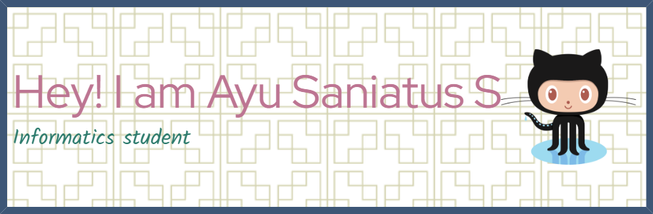

## Hello World! I'm Ayu Saniatus Sholihah 👋

-  Hi, I’m ayusaniatuss
- 🎓 I’m currently studying at Universitas Sebelas Maret, majoring in Informatics 
- 👀 I’m very interested website development
- 👀 I'm passionate about documenting innovations and research findings through scientific writing 
- 🌱 I’m currently learning programming algorithms and the web dev 

- 😄 Pronouns: she/her
- ⚡ Fun fact: Mornings are my peak productivity time for learning

#### I’m learning

#### Connect with me
  

<!---
AyuSaniatusSholihah/AyuSaniatusSholihah is a ✨ special ✨ repository because its `README.md` (this file) appears on your GitHub profile.
You can click the Preview link to take a look at your changes.
--->
